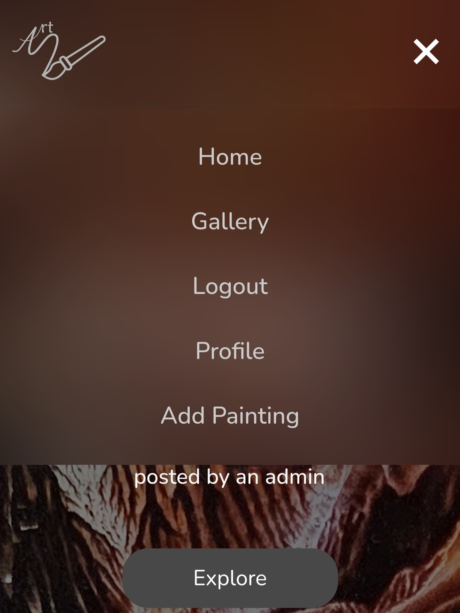

# Gallery-Site-Fullstack
This repository is my project with Angular called Gallery Site (Fullstack with a focus on Front-End)


<p align='center'>
    
</p>


This repository is my project with Angular, Typescript and Express called Gallery Site. It's a fullstack application.
## Overview
This website is a platform for people who are art lovers and want to share some beautiful paintings between each other. The project utilizes various technologies including RESTful APIs powered by Express for the backend, user authentication with JWT (JSON Web Tokens), Angular for the frontend, and MongoDB with Mongoose for data storage.

## Functionality

### User Authentication

- **Login:** Users can authenticate by providing their credentials.
- **Register:** New users can create an account by providing necessary information.

### Reviews

- **View Reviews:** Users can browse and view existing reviews.
- **Create Reviews:** Admin can create new reviews.
- **Edit and Delete Reviews:** Admin can edit and delete their own reviews.
- **Like Reviews:** Users can like reviews.

### Profile Page

- **View Profile:** Users can view their own profile with their liked posts; admins can also see their created posts.

## Installation
First clone or download (and extract) the ZIP file of this repository  
Then:
```bash
cd client 
npm i
cd ../
cd server
npm i
```
If you don't have angular installed firstly install it using this command
```bash
npm install -g @angular/cli
```

## Usage
### Open two terminals from the root project directory
In the first one enter the server folder and start the server
```bash
cd server
npm run start
```

In the second one enter the client folder and start the client.
```bash
cd client
ng serve
```

## Technologies Used

- **Frontend:**
  - Angular: A JavaScript framework for building user interfaces.
  - RxJS: a library for reactive programming using observables that makes it easier to compose asynchronous or callback-based code.

- **Backend:**
  - Express: A fast, unopinionated, minimalist web framework for Node.js.
  - MongoDB (Mongoose): A MongoDB object modeling tool designed to work in an asynchronous environment.
  - Bcrypt: A library for hashing passwords.
  - JWT (JSON Web Tokens): A compact, URL-safe means of representing claims to be transferred between two parties.

## Currently working on

- Mobile View

## Screenshots

### Desktop view
- **Home page**
<p align='center'>
    
</p>

- **Gallery**
<p align='center'>
    
</p>

- **Details page**
  - Admin
    <p align='center'>
      
    </p>
  - User (not liked)
    <p align='center'>
      
    </p>
  - User (liked)
    <p align='center'>
      
    </p>  
  - Guest
    <p align='center'>
      
    </p>

- **Login**
<p align='center'>
    
</p>

- **Register**
<p align='center'>
    
</p>

- **Edit**
<p align='center'>
    
</p>

- **Add Painting**
<p align='center'>
    
</p>

- **Profile page**
  - Admin
    <p align='center'>
      
    </p>
  - User (without liked paintings)
    <p align='center'>
      
    </p>
  - User (with liked paintings)
    <p align='center'>
      
    </p>

- **Navbar**
  - Admin
    <p align='center'>
      
    </p>
  - User
    <p align='center'>
      
    </p>
  - Guest
    <p align='center'>
      
    </p>

### Mobile view (unfinished)
- **Home page**
<p align='center'>
    
</p>

- **Gallery**
<p align='center'>
    
</p>

- **Login**
<p align='center'>
    
</p>

- **Register**
  - With Errors
    <p align='center'>
        
    </p>

  - Without Errors
  <p align='center'>
        
    </p>

- **Navbar**
  - Admin
    <p align='center'>
      
    </p>
  - User
    <p align='center'>
      
    </p>
  - Guest
    <p align='center'>
      
    </p>